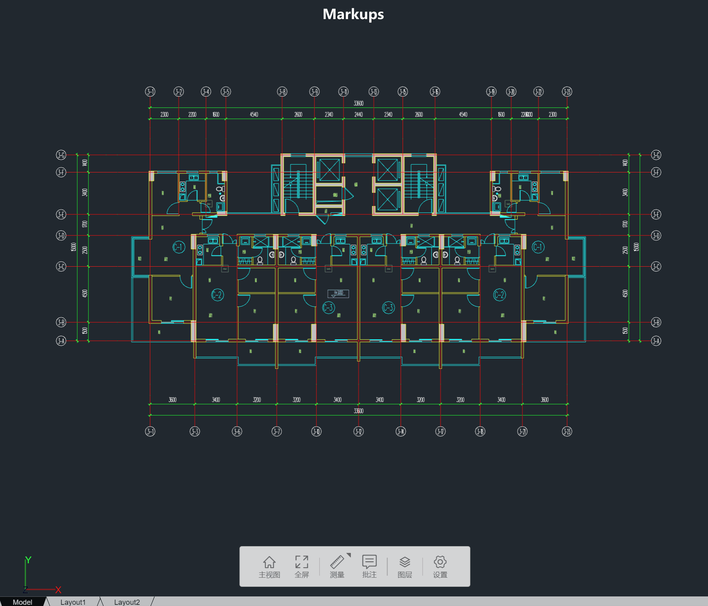
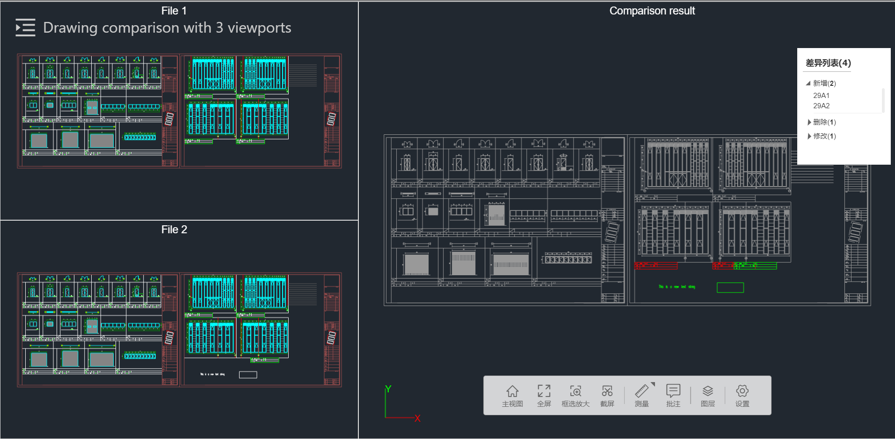
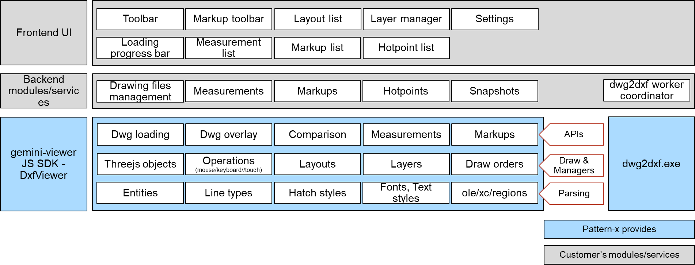
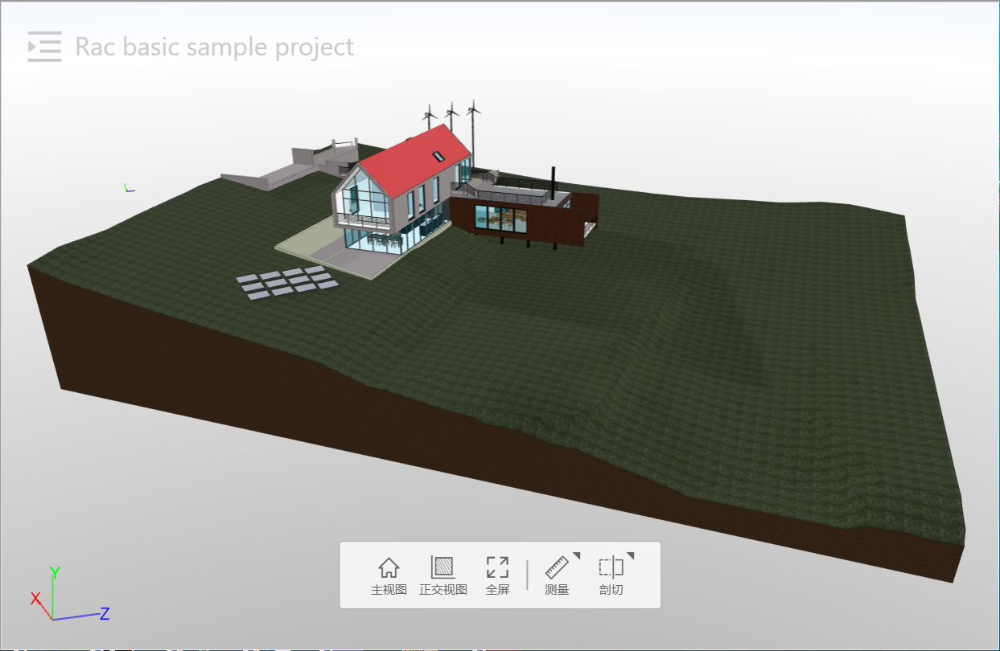
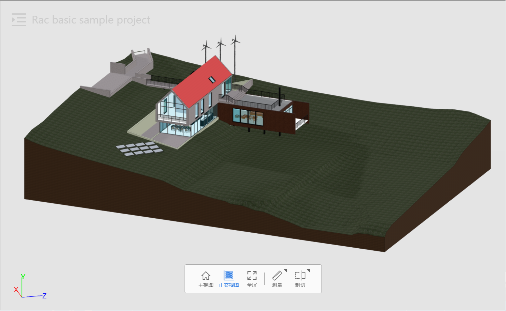
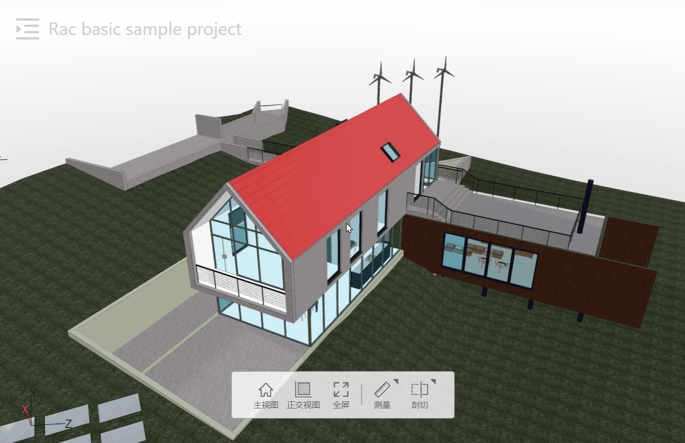
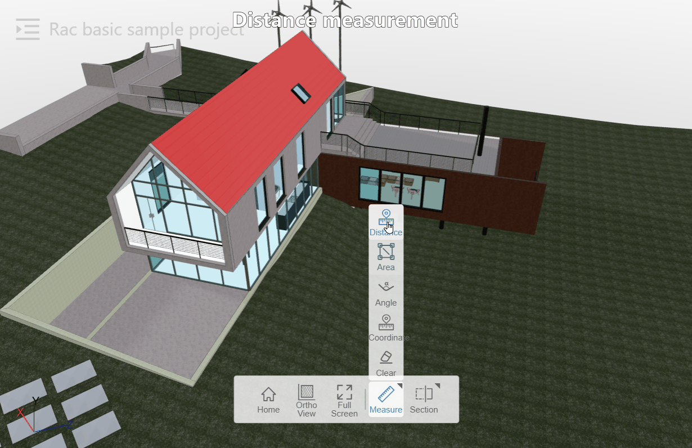
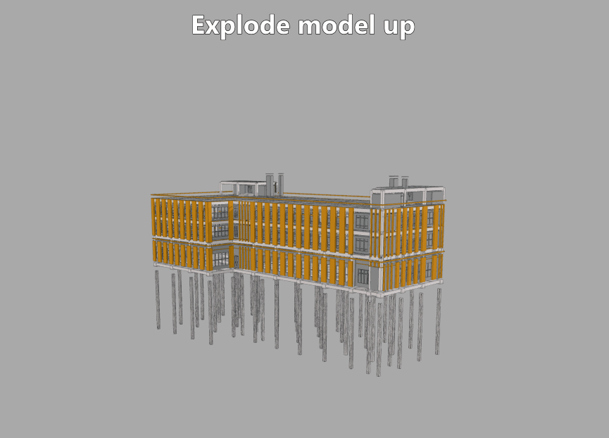
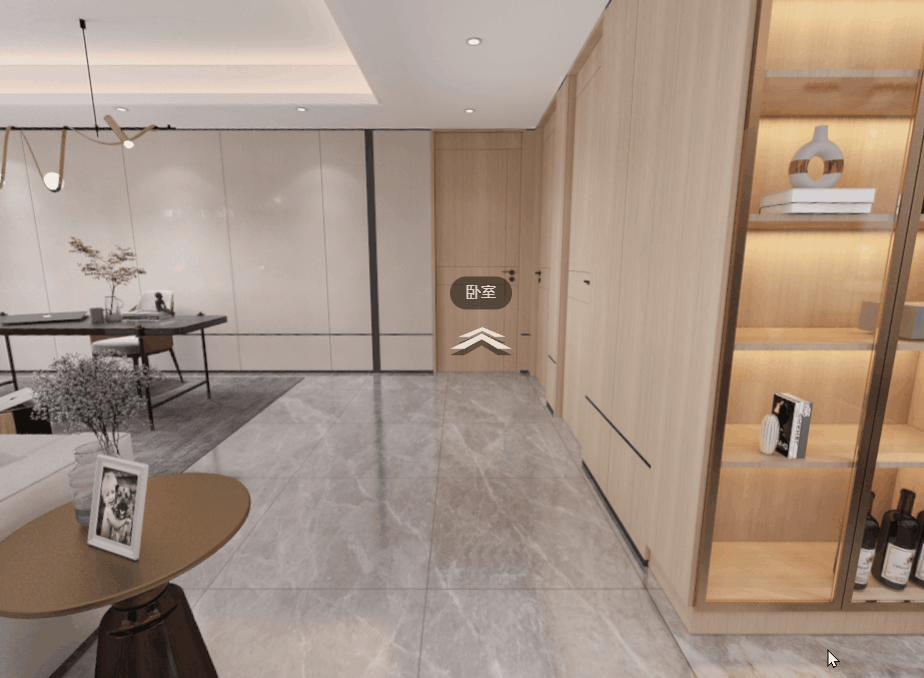
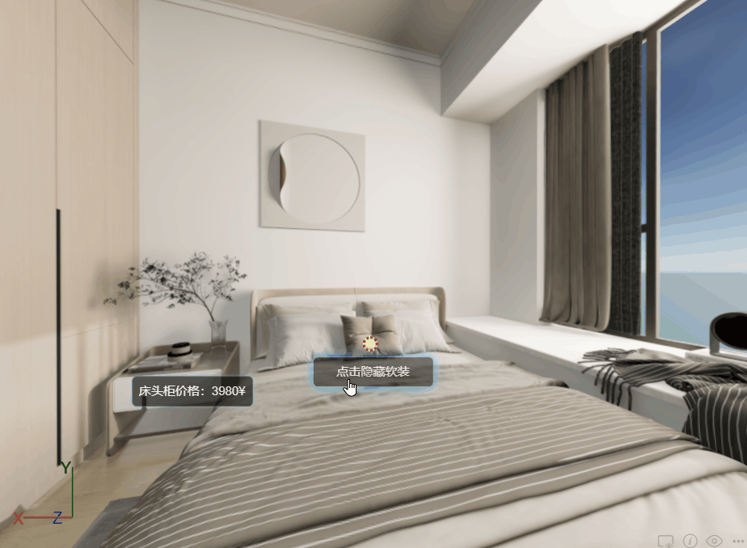

# gemini-viewer-examples
Examples and demos for gemini-viewer sdk.

- [Online examples](https://pattern-x.github.io/gemini-viewer-examples/)
- [Online demos](https://pattern-x.github.io/gemini-viewer-examples/#/demo/)

# Set up the example project
npm install

npm start

http://localhost:3000/


# gemini-viewer
gemini-viewer is a WebGL based JS SDK, it is built on top of three.js. It provides following viewers:

#### 1. DxfViewer
Used to view 2d drawings. Dxf format is supported, so we need to convert dwg files to dxf first (there is a dwg2dxf.exe worker). It supports most common entity types, it supports OLE and region via dwg2dxf; It supports common line types; It supports common hatch styles; It support line width;

#### 2. BimViewer
Used to view 3d BIM models. It supports formats including gltf, obj, fbx, ifc, dae, etc. Its features including measurement, section, display outline, orthographic camera, selection, etc.

#### 3. VRViewer
Used to view panoramas. It supports viewing a panorama with 1 image, 6 images, or 24 images; It supports viewing a serials of panoramas; It supports hotpoints;

## Installation
To install from npm:
```
npm install @pattern-x/gemini-viewer-threejs
```

## Examples for DxfViewer
``` typescript
import { DxfViewer, DxfViewerConfig, ModelConfig } from "@pattern-x/gemini-viewer-threejs";

const viewerCfg: DxfViewerConfig = {
    containerId: "myCanvas",
    enableToolbar: true,
    enableSpinner: true,
    enableLayoutBar: true,
};
const modelCfg: ModelConfig = {
    modelId: "id_0",
    name: "sample",
    src: "http://www.abc.com/sample.dxf",
}
const fontFiles = ["http://www.abc.com/hztxt.shx", "http://www.abc.com/simplex.shx"];

const viewer = new DxfViewer(viewerCfg);
await viewer.setFont(fontFiles);
await viewer.loadModelAsync(modelCfg, (event) => {
    const progress = (event.loaded * 100) / event.total;
    console.log(`${event.type}: ${progress}%`);
});
console.log("Loaded");
viewer.goToHomeView();
```

## Features for DxfViewer
- DxfViewer features includes: load and view one or more dxf files, basic mouse/key operations, layouts, layers, distance/area/angle measurements with osnaps, markups, hotpoints, comparison, undo/redo for measurements/markups, zoom to selected area, screenshots, set background color, etc.
- Supported entity types includes: POINT, 3DFACE, ARC, ATTDEF, ATTRIB, CIRCLE, DIMENSION, MLEADER, MULTILEADER, ELLIPSE, HATCH, INSERT, LEADER, LINE, LWPOLYLINE, MTEXT, RAY, POLYLINE, SOLID, SPLINE, TEXT, VERTEX, VIEWPORT, XLINE, etc. IMAGE, OLE2FRAME, REGION are partially supported.

- Load and view dxf file
{: width="400px"}
- Switch between layouts
{: width="400px"}
- Distance measurement
{: width="400px"}
- Area measurement
- Angle measurement
- Markups
{: width="400px"}
- Comparison
{: width="400px"}
{: width="400px"}
- Undo/redo

## DxfViewer limitations
- It doesn't support complex linetypes, e.g., linetype with text in it.
- It uses line geometries to represent texts rather than mesh, for a better performance.
- It doesn't support polyline with different start and end width.
- It doesn't support Tangent CAD, need to export to T3 format first.
- It supports dxf version "AutoCAD 2018", other versions are not well tested.

## How to integrate DxfViewer into your system
- Physical structure diagram:
{: width="400px"}
- Logical structure diagram:
{: width="400px"}

## Features for BimViewer
- Load and view BIM model
{: width="400px"}
- Orthographic view
{: width="400px"}
- Selection
{: width="400px"}
- X-Ray
{: width="400px"}
- Distance measurement
{: width="400px"}
- Section
{: width="400px"}
- Overlay 3d model with dxf

- Explode



## Features for VRViewer
- Load and view a panorama
{: width="400px"}
- Switch to another panorama
{: width="400px"}
- Switch between decorations
{: width="400px"}
